# 【仿 muduo 服务器】开发日志 - Day 1

### 1. 今日开发模块

* **模块名称**：timewheel
* **核心目标**：实现针对高性能网络连接（Non-blocking IO）空闲超时的非阻塞自动清理机制，利用智能指针与哈希表联合压榨定时任务的增删改查性能。

### 2. 架构设计与逻辑思索

* **智能指针生存期闭环控制**：
  整个时间轮由一个二维动态数组 `_wheel` 构成一个环形表盘。表盘的每个槽位（Slot）都是一个 `std::vector<std::shared_ptr<TimerTask>>` 容器。
  1. **刷新与延迟 (`TimerRefresh`)**：哈希表 `_timers` 内部使用 `std::weak_ptr` 弱引用保存任务，避免了与轮子发生循环引用死锁。需要刷新时，利用 `lock()` 临时升级为 `shared_ptr` 重新塞入未来格子的尾部，延长寿命。
  2. **析构即执行**：秒针 `RunTimerTask()` 每秒前进一步并调用 `_wheel[_tick].clear()`。只要该任务在之前的格子中全部过期，其引用计数归零自动析构，在析构函数 `~TimerTask()` 中完美闭环触发具体的业务回调 `_task_cb()`。

```mermaid
graph TD
    %% 时间轮多组件解耦联动图
    TimerWheel[TimerWheel 核心表盘] -->|_wheel 二维数组| Slots[60 个物理槽位 Bucket]
    TimerWheel -->|_timers 哈希表| Map[std::unordered_map]
    
    Slots -->|持有强引用| Ptr[std::shared_ptr~TimerTask~]
    Map -->|持有弱引用 避免死锁| Weak[std::weak_ptr~TimerTask~]
    
    Ptr -->|析构函数触发| CB[_task_cb 业务回调]
    Ptr -->|绑定自身销毁| RF[_release 清理哈希表]

    style TimerWheel fill:#1f4e5b,stroke:#eed,stroke-width:2px
    style Slots fill:#2e6b75,stroke:#eed,stroke-width:1px
```



```cpp
// 优化后的唤醒/事件注册逻辑
using Functor = std::function<void()>;

class EventLoop {
 public:
  // 判断当前线程是否为拥有此 Loop 的主线程
  bool IsInLoopThread() const { return _thread_id == std::this_thread::get_id(); }

  // 保证任务绝对在主线程中安全执行
  void RunInLoop(Functor cb) {
    if (IsInLoopThread()) {
      cb(); // 主线程直接原地执行
    } else {
      QueueInLoop(std::move(cb)); // 子线程则将任务投递到队列
    }
  }

  // 将任务安全塞进主线程队列，并在必要时唤醒主线程
  void QueueInLoop(Functor cb) {
    {
      std::unique_lock<std::mutex> lock(_mutex); // 加锁保护，防止多线程扩容崩溃
      _pending_functors.push_back(std::move(cb)); 
    }

    // 如果是子线程调用，或者主线程正在疯狂消费任务，则必须唤醒
    if (!IsInLoopThread() || _calling_pending_functors) {
      WakeUp(); // 拍醒正阻塞在事件死等（Poll）中的主线程
    }
  }

  void Loop() {
    while (!_quit) {
      _active_channels.clear();
      _poller->Poll(&_active_channels); // 1. 阻塞等待网络内核事件

      for (auto* channel : _active_channels) {
        channel->HandleEvent(); // 2. 处理网络 IO 事件
      }

      DoPendingFunctors(); // 3. 消费子线程塞过来的跨线程注册任务
    }
  }

 private:
  std::thread::id _thread_id;          
  std::mutex _mutex;                   
  std::vector<Functor> _pending_functors; 
  bool _calling_pending_functors = false;
  bool _quit = false;

  void WakeUp(); // 跨线程通知（底层基于 eventfd 或 pipe 写入数据）
  void DoPendingFunctors(); // 提取 _pending_functors 队列并执行
};
```